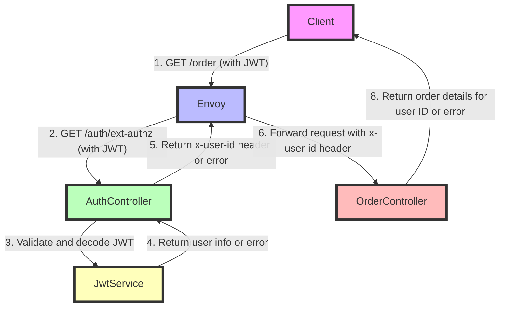
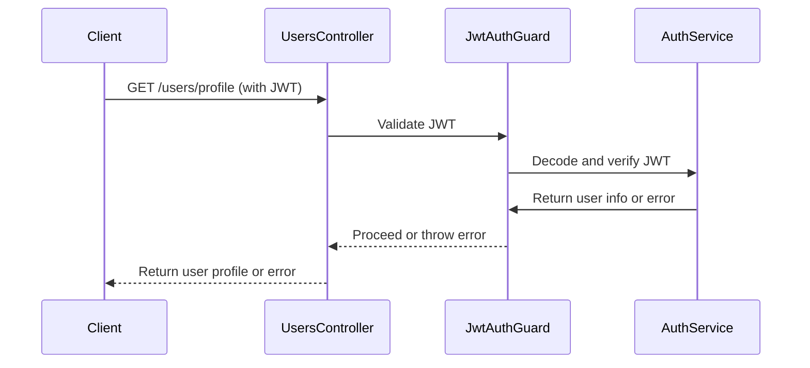
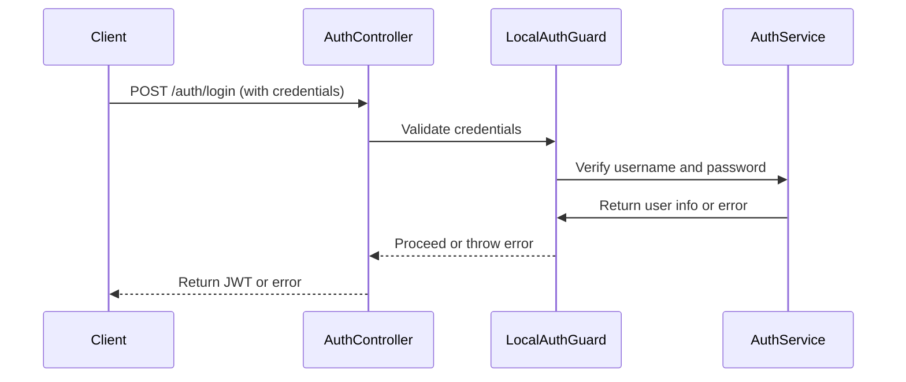

## Request Flow

```mermaid
graph TD
    Client -->|"1. GET /order (with JWT)"| Envoy
Envoy -->|"2. GET /auth/ext-authz (with JWT)"| AuthController
AuthController -->|"3. Validate and decode JWT"| JwtService
JwtService -->|"4. Return user info or error"| AuthController
AuthController -->|"5. Return x-user-id header or error"| Envoy
Envoy -->|"6. Forward request with x-user-id header"| OrderController

OrderController -->|"8. Return order details for user ID or error"| Client

style Client fill:#f9f,stroke:#333,stroke-width:4px;
style Envoy fill:#bbf,stroke:#333,stroke-width:4px;
style AuthController fill:#bfb,stroke:#333,stroke-width:4px;
style JwtService fill:#ffb,stroke:#333,stroke-width:4px;
style OrderController fill:#fbb,stroke:#333,stroke-width:4px;

```

## Fetching User Profile with JwtAuthGuard

```mermaid
sequenceDiagram
    participant Client
    participant UsersController
    participant JwtAuthGuard
    participant AuthService

    Client->>UsersController: GET /users/profile (with JWT)
    UsersController->>JwtAuthGuard: Validate JWT
    JwtAuthGuard->>AuthService: Decode and verify JWT
    AuthService->>JwtAuthGuard: Return user info or error
    JwtAuthGuard-->>UsersController: Proceed or throw error
    UsersController-->>Client: Return user profile or error

```

## Login with LocalAuthGuard

```mermaid
sequenceDiagram
    participant Client
    participant AuthController
    participant LocalAuthGuard
    participant AuthService

    Client->>AuthController: POST /auth/login (with credentials)
    AuthController->>LocalAuthGuard: Validate credentials
    LocalAuthGuard->>AuthService: Verify username and password
    AuthService->>LocalAuthGuard: Return user info or error
    LocalAuthGuard-->>AuthController: Proceed or throw error
    AuthController-->>Client: Return JWT or error

```
