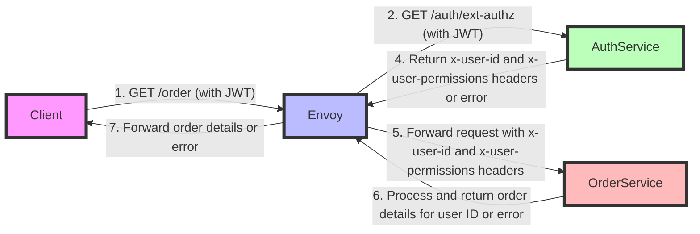
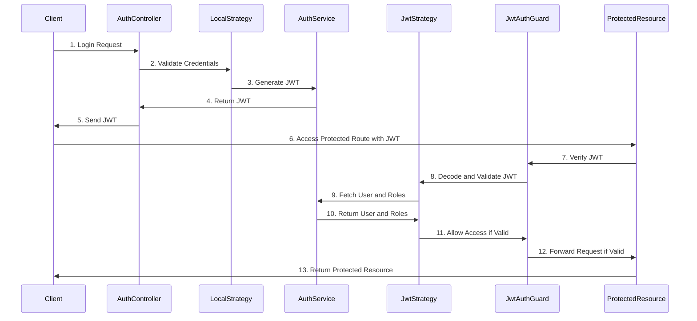
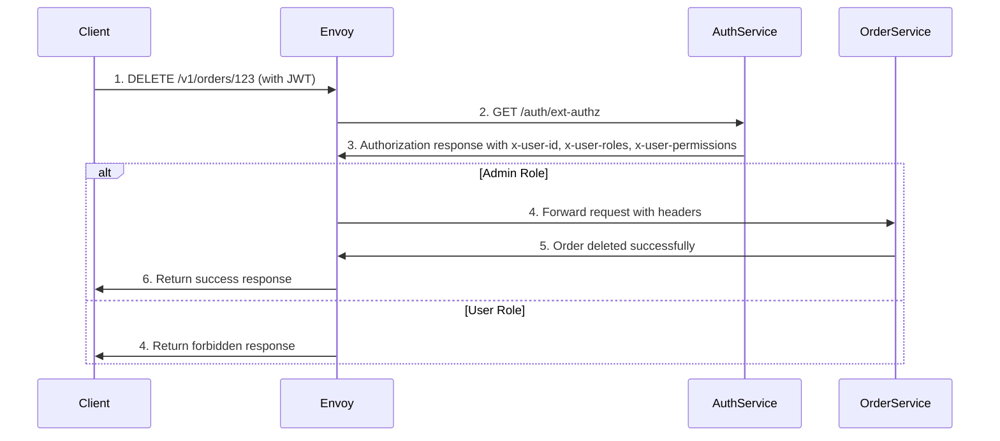

[//]: # (https://stackoverflow.com/questions/73839865/envoy-proxy-external-authorization-with-sub-path)


## Request Flow


1. The client sends a request to the Envoy proxy with a JWT token.
2. Envoy forwards the request to the AuthService to validate the JWT token.
3. AuthService returns the user ID and permissions or an error.
4. Envoy forwards the request to the OrderService with the user ID and permissions.
5. OrderService processes the request and returns the order details or an error.
6. Envoy forwards the order details or error to the client.

## Prerequisites
- Kubernetes cluster
- Helm installed
- kubectl configured

## Installation

### Deploy Services
```
node deploy-auth
node deploy-order
node deploy-product
node deploy-envoy
```

### AUTH Service



There is no signup or registration process in this project. The user can log in with a predefined username and password. The Auth service generates a JWT token and returns it to the client. The client can then use the JWT token to access protected resources.

Use default user with roles and permissions:

```ts
// auth/src/users/users.service.ts
private async initUsers() {
    this.users = [
        {
            userId: 1,
            username: 'john',
            password: await bcrypt.hash('changeme', 10),
            roles: [Role.ADMIN],
        },
        {
            userId: 2,
            username: 'chris',
            password: await bcrypt.hash('secret', 10),
            roles: [Role.MANAGER],
        },
        {
            userId: 3,
            username: 'maria',
            password: await bcrypt.hash('guess', 10),
            roles: [Role.USER],
        },
    ];
}
```

#### Validate JWT and Set User Context To Request Headers

```ts
// auth/src/auth/auth.controller.ts
@Get('ext-authz/*')
  async authz(
    @Headers('authorization') authHeader: string,
    @Res() res: Response,
  ) {
    console.log('entered authz');
    if (!authHeader) {
      return res.status(401).send('Authorization header missing');
    }

    const token = authHeader.split(' ')[1];
    if (!token) {
      return res.status(401).send('Token missing');
    }

    try {
      const decoded = this.jwtService.verify(token);
      const userId = decoded.sub; // Assuming 'sub' contains the user ID
      const user = await this.usersService.findById(userId);
      const roles = user.roles.join(',');
      const permissions = user.roles
        .flatMap((role) => RolesPermissions[role as Role])
        .join(',');

      res.setHeader('x-user-id', userId);
      res.setHeader('x-user-roles', roles);
      res.setHeader('x-user-permissions', permissions);

      return res.status(200).send('Authorized');
    } catch (err) {
      return res.status(401).send('Invalid token');
    }
  }
```

### Order Service

#### DELETE ORDER
To delete order by order ID, the user must have the permission to delete an order. The Order service checks the user permissions in the request headers and allows the request only if the user has the required permissions.




## Test

### Get JWT Token

### Login with ADMIN
```bash
POST http://localhost:3000/auth/login
Content-Type: application/json

{
  "username": "john",
  "password": "changeme"
}
```

### Login with USER
```bash
POST http://localhost:3000/auth/login
Content-Type: application/json

{
  "username": "maria",
  "password": "guess"
}
```

### DELETE ORDER
```bash
DELETE http://localhost:3000/v1/orders/1
Authorization: Bearer {{token}}
```

